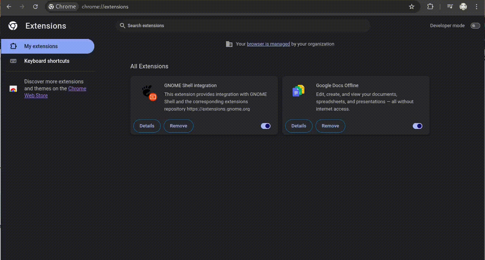

## chrome-web-tweaker

> Customizable CHROME extension tweaking sites to have certain edits.

### What? Why?

* Currently it does following..

> * Hides all Google Ads, that gets shown in `div[data-google-query-id]`.
> * Hides ads shown in containers with `*[class=c-ads]`.

* The purpose of this local extension is simple. Load it in your local chrome and keep tweaking a set of CSS/JS actions you wish to have applied by default.

### How To Install?

> * 1. Open [chrome://extensions/](chrome://extensions/).
> * 2. Enable `Developer Mode`.
> * 3. If drag-n-drop of this dir on the page doesn't work.. Click `Load Unpacked` button and select this dir.

### How To Customize It To Your Own Needs?

> Currently the extension `matches` covers all websites served under `https/http`. To limit it to certain websites only; replace the list with regexp/full-paths of such URLs. Allowed match patterns syntax could be referenced from Helpful Links below.

* Edit [styles.css](./styles.css) to apply a Styling change to all matched URLs.

* Edit [content.js](./content.js) to apply a Javascript induced change to all matched URLs.

* Edit [manifest.json](./manifest.json) to add any other added CSS/JS file or other manifest configs.

* After editing any file; go to [chrome://extensions/](chrome://extensions/) and click `Reload` icon on the card for this extension.

### Helpful Links

* [Help on manifest's match patterns](https://developer.chrome.com/docs/extensions/develop/concepts/match-patterns)

---
